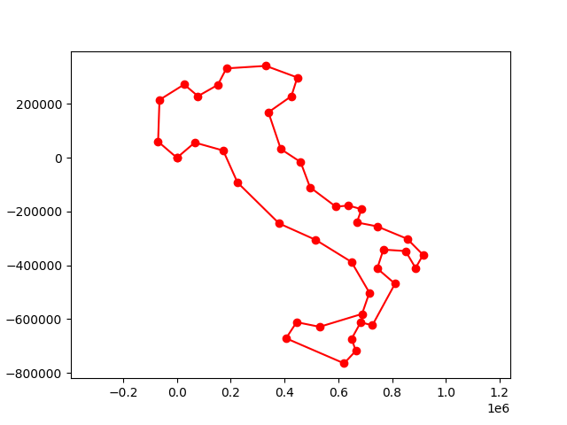

# Tool to import GPS coordinates

Use this tool (https://www.mapdevelopers.com/distance_finder.php) to select an area and import the GPS coordinates into python. 

## Usage

* Select the area with https://www.mapdevelopers.com/distance_finder.php
* paste the URL in a text file (like `measure_italy.txt`)
* adjust your filename in import or write your own wrapper, depending on what you need
* execute: `python3 import.py`
* it will show you the are in a matplotlib plot, with the GPS latitude and longitude converted into a local cartesian coordinate system
* it also calculates the size of the area

## License

GNU General Public License Version 3, see [License](./License.md)
